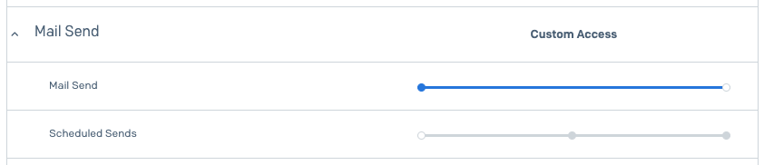

# `@santospatrick/notify`
>
> This library provides an easy-to-use notification system that supports sending notifications via email and SMS using third-party providers.


[](https://www.npmjs.com/package/@santospatrick/notify)
[](https://www.npmjs.com/package/@santospatrick/notify)


## Table of Contents

- [Features](#features)
- [Installation](#installation)
  - [Using `npm`](#using-npm)
  - [Using `yarn`](#using-yarn)
  - [Using `pnpm`](#using-pnpm)
- [Usage](#usage)
  - [Example: Sending an email](#example-sending-an-email)
    - [Configuration: Setting up NotificationManager](#configuration-setting-up-notificationmanager)
    - [Usage: Sending an email](#usage-sending-an-email)
- [Third-Party Providers](#third-party-providers)
  - [Email Providers](#email-providers)
    - [How to get Twilio Sendgrid Grid API Key](#how-to-get-twilio-sendgrid-grid-api-key)
- [Local Development](#local-development)
  - [Step-by-Step Guide](#step-by-step-guide)

## Features

- Send Email notifications
- Send SMS notifications
- Centralized notification management
- Flexible architecture for extending to other notification channels

## Installation

You can install this library using any of the following package managers:

### Using `npm`

```bash
npm install @santospatrick/notify
```

### Using `yarn`

```bash
yarn add @santospatrick/notify
```

### Using `pnpm`

```bash
pnpm add @santospatrick/notify
```

## Usage

### Example: Sending an email

Here’s a basic example of how to send an email using the `NotificationManager` from the library:

#### Configuration: Setting up NotificationManager

First, create a file named `notificationConfig.ts` to configure the `NotificationManager`:

```typescript
// notificationConfig.ts
import { NotificationManager, EmailProviders } from '@santospatrick/notify';

// Create a new instance of NotificationManager
const notificationManager = new NotificationManager();

// Setup email service to use Twilio SendGrid (more to come!)
notificationManager.addEmailService({
  provider: EmailProviders.SENDGRID,
  apiKey: 'YOUR_API_KEY_HERE', // Your Twilio SendGrid API key that starts with "SG."
});

export { notificationManager };
```

#### Usage: Sending an email

Now, create another file named `sendEmail.ts` to use the `notificationManager` object for sending an email:

```typescript
// sendEmail.ts
import { notificationManager } from './notificationConfig';

// Send notification
notificationManager
  .send({
    from: 'info@santospatrick.com', // Needs to be a "Single Sender" verified in SendGrid.
    to: 'info@santospatrick.com',
    subject: 'Hello from my application!',
    html: '<strong>Hi there! Using @santospatrick/notify lib.</strong>',
  })
  .then(() => {
    console.log('Email sent!');
  })
  .catch((error) => {
    console.error(error);
  });
```

## Third-Party Providers

### Email Providers

#### How to get Twilio Sendgrid Grid API Key

This library uses SendGrid to send email notifications. To set up the SendGrid API key:

1. Sign up for a [Twilio SendGrid account](https://sendgrid.com/).
2. Go to `Settings > Sender Authentication > Verify a Single Sender > "Create New Sender"`.
3. Fill out the form and click **"Create"**.
4. Go to `Settings > API Keys > "Create API Key"`.
5. Give it a name and select **"Restricted Access"**, click **"Mail Send"** and enable **"Mail Send"** (this is the only permission needed).

6. Click **"Create & View"** and copy the API key.

## Local Development

To test the library locally while developing, you can use `npm link`. This allows you to symlink your local development version of the library into another project.

### Step-by-Step Guide

1. In the root directory of your library, run:

```bash
npm link
```

This will create a global symlink to your library.

2. In the project where you want to test the library, run:

```bash
npm link @santospatrick/notify
```

This will create a symlink from the global `@santospatrick/notify` to the `node_modules` of your project.

3. Make changes to this library and run `yarn build` to compile the TypeScript code.

4. Run your project and test the changes.

### Publishing to `npm`, `yarn` and `pnpm`

To publish the library to npm, follow these steps:

1. Ensure your code is ready for publishing by running the build command:

```bash
yarn build
```

2. Update the version number in the `package.json` file.

```json
{
  "version": "0.0.3" // Next version to be published
}
```

3. Once the build is successful, publish the package to npm with public access:

```bash
npm publish --access public
```

This will publish your library to the npm registry, making it available for others to install and use.

Made with ❤️ by Patrick Santos
